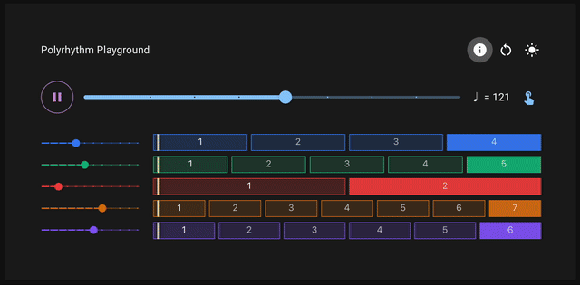

# Polyrhythm Playground

An interactive web application for exploring polyrhythms. Try out different rhythm combinations and improve your understanding of complex rhythmic patterns.

[Live demo](https://yyogo.github.io/polyrhythms/)



## Features

- Up to 5 simultaneous rhythms
- Adjustable tempo
- Tap tempo functionality
- Keyboard shortcuts for quick control
- Audio feedback for each beat
- Live rhythm visualization

## Running Locally

1. Clone the repository
2. Install dependencies:
   ```bash
   pnpm install
   ```
3. Start the development server:
   ```bash
   pnpm run dev
   ```

## Built with
- React
- TypeScript
- Vite
- Material-UI
- Web Audio API